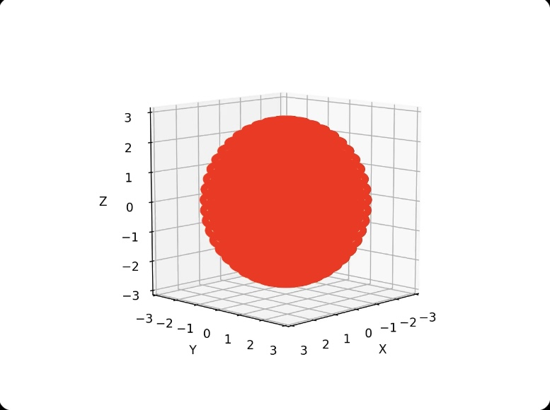
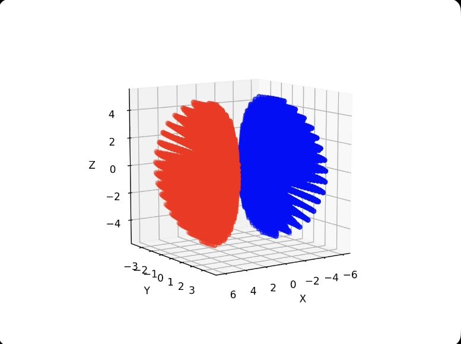
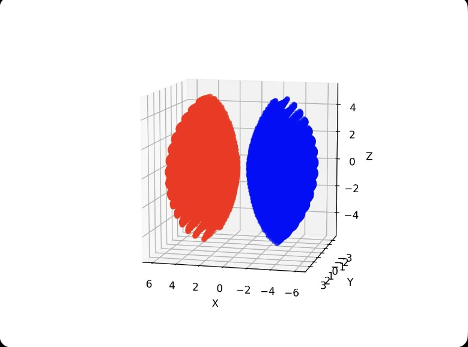
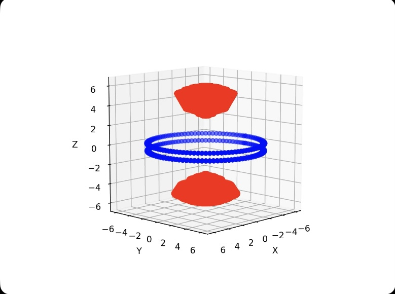
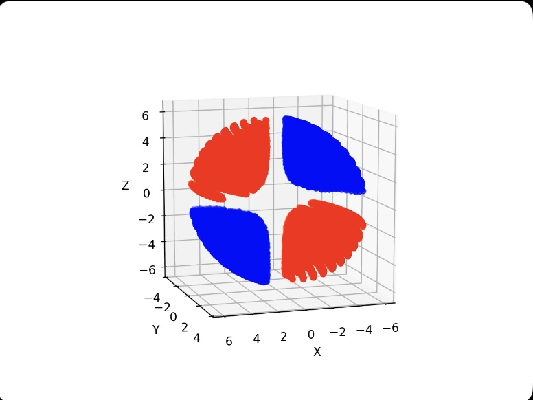
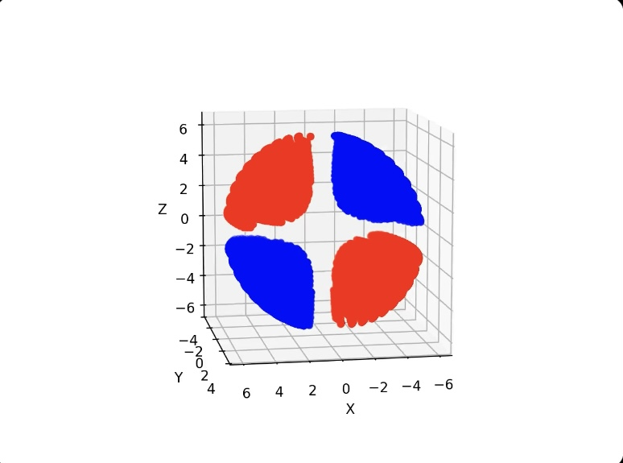
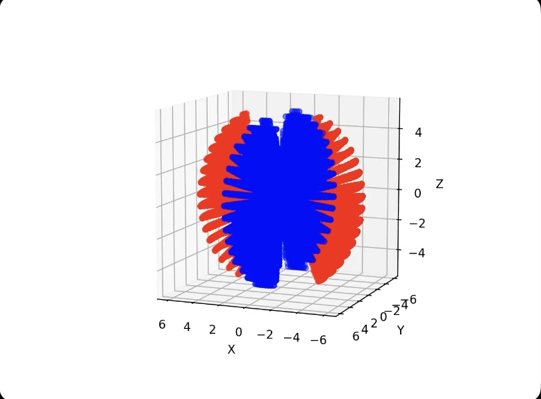
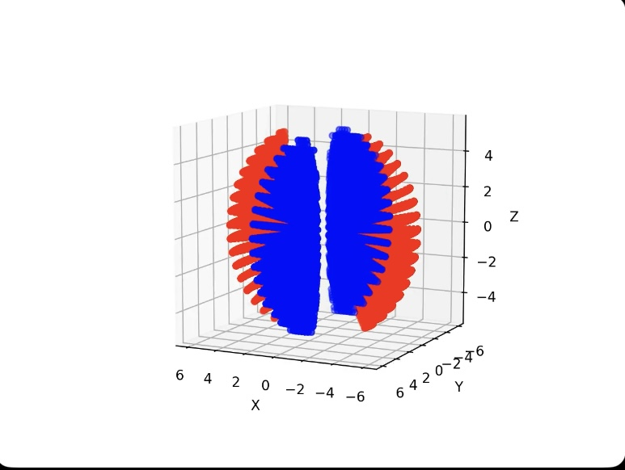

# 오비탈 렌더링 (2024.5)

## 개요

본 탐구에서는 python의 numpy와 matplotlib을 이용하여 슈뢰딩거의 파동방정식을 시각화하고 수소꼴 원자의 오비탈들을 렌더링하였다.

## 이론

### 원자 오비탈

원자가 포함한 전자들은 무작위적으로 발견되지 않고, 확률적으로 일정한 분포를 가지기 떄문에 이를 파동함수로 대략적으로 일반화할 수 있다. 파동함수의 제곱은 전자 존재의 확률 밀도를 나타내는데, 이를 특정 범위 이상으로 필터링한 것은 원자 오비탈이라 한다.


### 양자수

양자수는 오비탈이 가지는 요소를 말하는 것으로, 주양자수, 부양자수, 그리고 방위 양자수의 세가지를 가진다.
주양자수(n)은 오비탈 에너지에 해당하는 값, 즉 오비탈이 존재하는 전자 껍질을 말한다. 수소꼴 원자에서는 주양자수에 의해 에너지 준위가 결정된다.
부양자수(l)은 오비탈의 모양을 나타내는 양자수로, s, p, d, f 등의 모양은 이 부양자수, 혹은 각운동량 양자수에 의하여 결정된다.
자기 양자수(m)은 오비탈의 방향을 정하는 양자수로, 예를 들어 p 오비탈의 경우 각각 x, y, z축 방향을 뜻하는 3가지를 구분하는 양자수이다.

### 구형 극좌표계

슈뢰딩거 파동함수는 3차원 구형 극좌표계에서 동작한다. 구형 극좌표계는 (r, θ, φ) 꼴의 좌표를 사용하는데, r은 원점에서 점이 떨어진 거리, θ는 위도, 그리고 φ는 경도를 의미한다. 구형 극좌표계에서의 점 (r, θ, φ)은 직교좌표계에서 $ (r * sinθ * cosφ, r * sinθ * sinφ, r * cosθ) $ 로 변환된다.

### 슈뢰딩거의 파동함수


슈뢰딩거의 파동함수는 $ ψ(r, θ, φ) = R(r) * Y(θ, φ) $ 꼴로 나타낸다. R은 방사방향 파동함수로, 극좌표계상에서의 거리에만 영향을 받으며, Y는 각파동 함수로, 극좌표계상에서의 위도와 경도에만 영향을 받는다. 이 파동함수는 각각의 오비탈 양자수에 따라 달라진다.

## 구현

파이썬 코드 실행 시 들어오는 전달인자를 오비탈의 종류로 받아 렌더링하는 구조로 구현하였다.

### 사전 변수 정의

```python
orbital = str(sys.argv[1])
bohr_radius = 1.5
hz = 2 * 10 ** 10
judgeRate = 1
```

위 코드에서 ```orbital```은 전달인자로 받은 오비탈의 종류, ```bohr_radius```는 보어 반지름 $a_0$, ```hz```는 수소꼴 원자의 양성자 수, 그리고 ```judgeRate```는 추후 확률밀도를 필터링하는 기준으로 사용하는 변수이다. 위에서 ```bohr_radius```와 ```hz```는 좌표축 스케일에 맞도록 확대하였다.

### 파동함수 정의

```python
def fR(rad):
    if orbital == 's0':
        return 2 * np.sqrt((hz / bohr_radius) ** 3) * np.exp(-0.5 * hz * rad / bohr_radius)
    elif orbital == 'p-1' or orbital == 'p0' or orbital == 'p1':
        return rad * np.exp(-rad / (2 * bohr_radius)) / (np.sqrt(24 * (bohr_radius ** 5)))
    elif orbital == 'd-2' or orbital == 'd-1' or orbital == 'd0' or orbital == 'd1' or orbital == 'd2':
        return 4 * rad * rad * np.exp(-rad / (3 * bohr_radius)) / (81 * np.sqrt(30 * ((bohr_radius) ** 3)) * (bohr_radius ** 2))

def fY(th, ph):
    if orbital == 's0':
        return np.sqrt(1 / (4 * np.pi))
    elif orbital == 'p-1':
        return np.sqrt(3 / (8 * np.pi)) * np.sin(th) * np.exp(-ph * 1j)
    elif orbital == 'p0':
        return np.sqrt(3 / (4 * np.pi)) * np.cos(th)
    elif orbital == 'p1':
        return np.sqrt(3 / (8 * np.pi)) * np.sin(th) * np.exp(ph * 1j)
    elif orbital == 'd-2':
        return np.sqrt(5 / (32 * np.pi)) * np.sin(th) * np.sin(th) * np.exp(-2 * ph * 1j)
    elif orbital == 'd-1':
        return np.sqrt(5 / (8 * np.pi)) * np.cos(th) * np.sin(th) * np.exp(-ph * 1j)
    elif orbital == 'd0':
        return np.sqrt(5 / (16 * np.pi)) * (3 * (np.cos(th) ** 2) - 1)
    elif orbital == 'd1':
        return np.sqrt(5 / (8 * np.pi)) * np.cos(th) * np.sin(th) * np.exp(ph * 1j)
    elif orbital == 'd2':
        return np.sqrt(5 / (32 * np.pi)) * np.sin(th) * np.sin(th) * np.exp(2 * ph * 1j)
```

각 오비탈에 따라 방사상 파동함수와 각파동함수가 다른 값을 가지므로, 이를 if문을 이용해 분리해준다. ```fR```은 방사상 파동함수, ```fY```는 각파동함수를 나타낸다.

### 판정 함수

```python
def judge(r, th, ph):
    wf = fR(r) * fY(th, ph)
    dP = (wf ** 2)
    return (dP >= judgeRate), (wf >= 0)
```

위 코드에서 ```judge``` 함수는 특정 공간에서 전자가 존재할 확률이 기준치보다 큰지 작은지에 따라 참 혹은 거짓의 boolean 값은 반환하는 함수이다.

### 극좌표계 설계

```python
r = np.linspace(0, 6, 10)
theta = np.linspace(0, 2 * np.pi, 50)
phi = np.linspace(0, 2 * np.pi, 50)

Xp = []
Yp = []
Zp = []

Xm = []
Ym = []
Zm = []
```

반지름 $r ∈ [0, 6]$ 의 공간상에서 확인하도록 설계하였다.
위 코드에서 ```Xp, Yp, Zp```는 파동함수의 값이 양수인 공간들, ```Xm, Ym, Zm```은 파동함수의 값이 음수인 공간들을 각각 저장하는 리스트이다.

### 분류

```python
while len(Xp) < 32000:
    judgeRate *= 0.9
    print("Judge Rate: " + str(judgeRate))
    for rad in r:
        for a in theta:
            for b in phi:
                res = judge(rad, a, b)
                if (res[0]):
                    if (res[1]):
                        Xp.append(rad * np.sin(a) * np.cos(b))
                        Yp.append(rad * np.sin(a) * np.sin(b))
                        Zp.append(rad * np.cos(a))
                    else:
                        Xm.append(rad * np.sin(a) * np.cos(b))
                        Ym.append(rad * np.sin(a) * np.sin(b))
                        Zm.append(rad * np.cos(a))
```

리스트의 원소 개수가 특정 값 이상이 될 때까지 기준치를 낮추어가며 필터링하는 방식이다.

### 플로팅

```python
fig = plt.figure()
ax = fig.add_subplot(111, projection='3d')

ax.scatter3D(Xp, Yp, Zp, color = 'red')
ax.scatter3D(Xm, Ym, Zm, color = 'blue')
ax.set_box_aspect([1, 1, 1])

ax.set_xlabel('X')
ax.set_ylabel('Y')
ax.set_zlabel('Z')

def animate(i):
    ax.view_init(elev=10, azim=i*4)
    return fig,

ani = animation.FuncAnimation(fig, animate, frames = 90, interval = 50, blit = True)
ani.save('./export/' + orbital + '.mp4', writer = 'ffmpeg', fps = 20)
```

결괏값을 3차원 matplotlib axis에 플롯하고, ffmpeg를 이용해 이를 .mp4 애니메이션 형식으로 저장한다.

## 결과물

다음은 이 코드를 실행하여 얻은 플로팅 결과물들이다.

### 1s0



### 2p0


### 2p1



### 2p-1



### 3d0



### 3d1



### 3d-1



### 3d2



### 3d-2



## 해석 & 결론

이 연구를 통하여 화학에서의 오비탈과 심화된 파동함수 개념까지 정리할 수 있었고, 동시에 matplotlib에서의 3차원 구형 극좌표계 플로팅을 익히고 . 비록 기대하였던 이상적인 모양이 나오지는 않았으나 이는 추후 수정해보고 싶다.

## 소스 코드 링크

https://github.com/jkmanyeEx/Orbital-Rendering